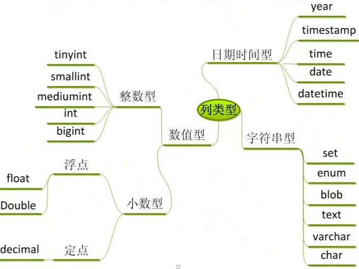

# 数据库基本概念与MySQL基础

## 实体

只要是在客观世界存在的、可以被描述出来的都是实体

## ****数据库管理系统(DBMS)****

是一种系统软件，提供操作数据库的环境，可以通过数据库管理系统对数据进行插入、修改、删除和查询等操作。

## SQL

结构化查询语言，专门用来和数据库进行交流的语言,几乎所有的DBMS都支持SQL

### ****SQL规范****

1. SQL语句不区分大小写，建议SQL关键字大写，表名和列表小写
2. 命令用分号结尾
3. 命令可以缩进和换行，一种类型的关键字放在一行
4. 可以写单行和多行注释 , #和--是单行注释，/***/多行注释

## ****数据表****

- 表是数据库中包含所有数据的数据库对象，也是其它对象的基础。
- 表定义是一个列的集合，数据在表中是按行和列的格式组织的，用来存放数据
- 行也称为记录用来存放一个个实体，列称为字段用来描述实体的某一个属性 学生管理系统

## MySQL简介

### MySQL特点

- 开源免费
- 性能高
- 安装使用都简单

### 安装、启动、停止、连接

```bash
#安装
brew install mysql
#启动
mysql.server start
#停止
mysql.server stop
# 设置密码
alter USER @localhost BY 'password'
# 连接
mysql -u root -p 
```

### **切换数据库**

```bash
use test;
```

### **显示有哪些表**

```bash
show tables;
show tablesfrom mysql;
```

### **显示当前数据库**

```bash
select database();
```

### **查询表结构**

```bash
DESC user;
```

### Navicat 中新建数据库

- 选择字符集 utf8mb4

### ****数据完整性****

- 为了实现数据完整性，需要检验数据库表中的每行和每列数据是否符合要求
- 在创建表的时候，应该保证以后的数据输入是正确的，错误的数据不允许输入

### ****域完整性****

不同的字段需要设置为各种合适的类型，比如年龄就是整数类型




### ****默认值****

默认值是指如果用户没有指定值的情况下会记录的此字段指定一个提供一个预先设定的值

> 可以把居住地默认值设置为北京
>

### ****非空约束****

我们可以指定某个字段不能不输入，必须提供一个非空的值

> 姓名字段不能为空
>

## 实体完整性

### 主键约束

- 表中一列或者几列组合的值能用来唯一标识表中的每一行，这样的列或者列组合称为表的主键，主键表的数据不同重复。
- 如果两列或者多列组合起来唯一标识表中的每一行，则该主键又称为"组合键"

### 主键的选择

1. 最少性 尽量选择单个键作为主键
2. 稳定性 ，由于主键是用来在两个表间建立联接的，所以不能经常更新，最好就不更新

### 外键

成绩表中的学生ID应该在学生表中是存在的 我们应该让成绩表中的ID只能引用学生表中的ID，它们的值应该是一一对应的，也就是说成绩表中的ID是成绩表中的外键，对应学生表的主键 ，这样就可以保证数据的引用完整性

### 唯一约束

唯一约束是指某个字段值是唯一的，在所有的记录中不能有重复的值.

> 学生的身份证号可以设置为唯一约束
>

### 外键约束

一个表的外键必须引用另一个表的主键,比如成绩表中的学生ID会引用学生表的主键，课程ID会引用成绩表的主键

- 主表没有记录，子表中不能添加相应的记录
- 修改和删除主表记录不能让子表记录孤立，必须相应修改和删除

## 常见SQL操作

```sql
-- 建表
CREATE TABLE `student` (
`id`  int(11) NOT NULL PRIMARY KEY AUTO_INCREMENT   ,
`name`  varchar(50) NOT NULL ,
`age`  int(11) NULL DEFAULT NULL ,
`city`  varchar(50) DEFAULT '北京' ,
)
SELECT * FROM student;
-- 查询列
DESC student;
-- 新增列
ALTER TABLE student ADD COLUMN idcard VARCHAR(20) NOT NULL AFTER city;
-- 修改列定义
ALTER TABLE student MODIFY COLUMN idcard VARCHAR(18) NOT NULL;
-- 删除列
ALTER TABLE student DROP COLUMN idcard;

-- 主键约束
ALTER TABLE `student` ADD PRIMARY KEY (`id`);
-- 唯一约束
ALTER TABLE `student` ADD UNIQUE INDEX `uq_idcard` (`idcard`) ;
-- 默认约束
ALTER TABLE `student` MODIFY COLUMN `city`  varchar(50)  DEFAULT '北京' AFTER `age`;
-- 外键约束
ALTER TABLE `score` ADD CONSTRAINT `fk_stuid` FOREIGN KEY (`student_id`) REFERENCES `student` (`id`);
-- 删除约束
ALTER TABLE `score` DROP FOREIGN KEY `fk_stuid`;

-- 插入时先插主表，再插子表。删除时先删除子表，再删主表
```

## SQL

Structured Query Language：结构化查询语言

### 为什么需要SQL

1. 使用界面操作数据库不方便
2. 我们需要通过应用程序去操作数据库

### ****SQL组成****

- ****DDL（data definition language）是数据定义语言****

    主要的命令有`CREATE`、`ALTER`、`DROP`等，**DDL**主要是用在定义或改变表（TABLE）的结构，数据类型，表之间的链接和约束等初始化工作上，他们大多在建立表时使用

- ****DML（data manipulation language）是数据操作语言****

    它们是`SELECT`、`UPDATE、`INSERT`、`DELETE`，就象它的名字一样，这4条命令是用来对数据库里的数据进行操作的语言

- ****DCL（DataControlLanguage）是数据库控制语言****

    是用来设置或更改数据库用户或角色权限的语句，包括（`grant`,`revoke`等）语句

### ****SQL运算符****

是一种符号，它是用来进行列间或者变量之间的比较和数学运算的

****算术运算符****

| 运算符 | 说明 |
| --- | --- |
| + | 加运算，求两个数或表达式相加的和，如1+1 |
| - | 减少减运算，求两个数或表达式相减的差，如4-1 |
| * | 乘运算，求两个数或表达式相乘的积，如2*2 |
| / | 除运算，求两个数或表达式相除的商，如6/4的值为1 |
| % | 取模运算，求两个数或表达式相除的余数，如：6%4的值为2 |

****逻辑运算符****

| 运算符 | 说明 |
| --- | --- |
| AND | 当且仅当两个布尔表达式都为true时，返回TRUE |
| OR | 当且仅当两个布尔表达式都为false，返回FALSE |
| NOT | 布尔表达式的值取反 |

****比较运算符****

| 运算符 | 说明 |
| --- | --- |
| = | 等于 |
| > | 大于 |
| < | 小于 |
| <> | 不等于 |
| >= | 大于等于 |
| <= | 小于等于 |
| != | 不等于 |

## ****数据操作语言****

### ****插入数据行****

```sql
INSERT  [INTO]  表名  [(列名)] VALUES  (值列表)
```

****插入记录****

```sql
--- 向学生表插入一条记录, 姓名张三,身份证号123456,年龄30,城市北京
INSERT INTO [school].[student]
(name,idcard,age,city)
VALUES
('张三','123456',30,'北京');
```

**注意事项**

- 每次插入一行数据，不能只插入一部分数据，插入的数据是否有效将按照整行的完整性要求来检验
- 每个数据值的数据类型、精度、位数必须与要应的列名精确匹配
- 不能为标识符指定值 (比如id)
- 如果某字段设置为不能为空，则必须插入数据
- 插入数据时还要符合检查性约束的要求
- 有缺省值的列，可以使用DEFAULT关键字来代替插入实际的值

### ****更新数据行****

```sql
UPDATE 表名 SET 列名 = 更新值 [WHERE 更新条件]
```

****更新记录****

```sql
--- 更新ID等于7的学生年龄改为40，城市改为上海
UPDATE [school].[student]
 SET age = 40,city = '上海'
WHERE id=7;
```

**注意事项**

- 多列时用逗号隔开，一定要加更新条件以免错误更新
- 多个联合条件使用 AND `id=7 and idcard='410787'`
- 判断某字段是否为空 `email is null or email = ''`

### ****删除数据****

```sql
DELETE [FROM]  表名 [WHERE <删除条件>]
```

****删除记录****

```sql
--- 删除ID=7的学生记录
DELETE FROM [school].[student] WHERE id=7;
```

****注意****

- Delete语句是对整行进行操作，因此不需要提供列名
- 如果要删除主表数据，则要先删除子表记录

### ****TRUNCATE 截断表****

```sql
TRUNCATE  TABLE  表名
```

****截断学生表****

```sql
TRUNCATE TABLE student;
```

> 数据全部清空，但表结构、列、约束等不被改动，不能用于有外键约束引用的表，标识列重新开始编号，因为要删除的数据不会写入日志，数据也不能恢复，所以工作中请尽量不要使用此命令。
>

### 数据查询

- 查询就是从客户端 发出查询请求数据库服务器，并从数据库返回查询结果的过程
- 每次执行查询只是从数据表中提取数据，并按表的方式呈现出来
- 查询产生的是虚拟表,并不会保存起来

```sql
SELECT    <列名> 
FROM      <表名> 
[WHERE    <查询条件表达式>] 
[ORDER BY <排序的列名>[ASC或DESC]]
```

****排序****

```sql
--- 查询北京的学生信息，并按ID正序排列
SELECT id,name,idcard,age,city
FROM student
WHERE home= '北京'
ORDER BY id asc;
```

**别名**

```sql
SELECT id,name,idcard,age,city AS home
FROM student
WHERE city= '山东'
ORDER BY id asc;
```

**查询空行**

```sql
SELECT id,name,age,city
FROM student
WHERE city is null or city ='';
```

****常量列****

```sql
SELECTid,name,age,city,'中国' as country
FROM student;
```

****限制返回的行数****

```sql
SELECT id,name,age,city,'中国' as country
FROM student limit 2;
--- limit 1,10; 检索从第2行开始，累加10条记录
```

****DISTINCT****

```sql
--- 查询同学们一共来自哪些不同的城市 （去重）
SELECT DISTINCT city,id FROM student;
```

**MYSQL中+号只能用作于数字**

```sql
SELECT 1+1
SELECT 1+'1'
SELECT 1+'zfpx'  
SELECT 1+null
SELECT CONCAT(city,'-',name) FROM student;
--- CONCAT 用于字符串拼接
```
